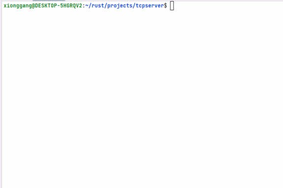

[](https://app.fossa.com/projects/git%2Bgithub.com%2Ftomxiong%2Ftcpserver?ref=badge_shield)
[](https://github.com/tomxiong/tcpserver/actions/workflows/test.yml)

# What is the project? 
* tcpserver is a simple TCP response server which can print message at server console and echo it to client.
I build this project for my homeworks of studying substrate development.


# Change logs:
 [x] Implement a simple echo tcp server with Rust std library 2022-07-08
 [x] Implement three example code for traffic light, sum some u32 values and use generic and trait feature  

# How to build it?
```shell
xionggang@DESKTOP-5HGRQV2:~/rust/projects/tcpserver$ cargo build --release
```
# How to use it?
```shell
xionggang@DESKTOP-5HGRQV2:~/rust/projects/tcpserver$ cd target/releases
xionggang@DESKTOP-5HGRQV2:~/rust/projects/tcpserver$ ./tcpserver
The first question is the time of the different color traffic light:
--------------------------------------------------------------------
Red light time is 30
Yellow light time is 5
Green light time is 45
--------------------------------------------------------------------
The second question is summing of vec u32 values:
--------------------------------------------------------------------
overflow!
Total value is :3469695880
--------------------------------------------------------------------
The third question is use generic and trait feature to calculate area of shapes:
--------------------------------------------------------------------
The shape area is 314
The shape area is 25
The shape area is 100
--------------------------------------------------------------------
```

```
# For more detail, please to see the animated graphics gif about "How to use it" like below：



# license
[](https://app.fossa.com/projects/git%2Bgithub.com%2Ftomxiong%2Ftcpserver?ref=badge_large)